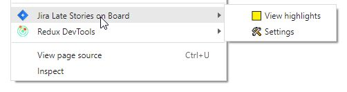
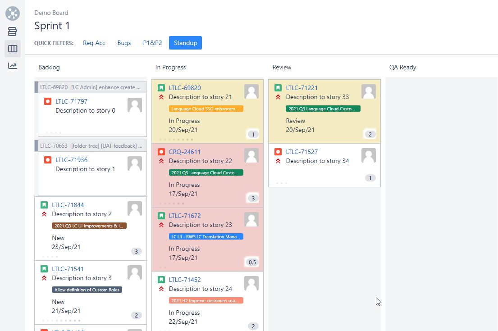

# Chorme extension to mark **Late** stories on Jira Board

## Usage

- **Right Click** in any page
- Click on **Jira Late Stories on Board** / **View highlights**
- It will open your Board if not opened
- When the board is already open View highlights will highlight cards 

## Results




## Setup

- Download this repo as zip
- Unzip it
- Open [chrome://extensions/](chrome://extensions/)
- **Load unpacked** Extension
- Right click to see results
- When new sprint is started use "Settings".

## Dev Only

Run this script to cleanup data for "demo" screens

```js
document.querySelector('#ghx-board-name').innerHTML = 'Demo Board';
document.querySelector('.subnavigator-title').innerHTML = 'Sprint 1';
document.querySelectorAll('.ghx-controls-filters dd')
    .forEach((e, i) => {if (i > 3) {e.innerHTML = ''}});
Array.from(document.querySelectorAll('.js-key-link'))
    .forEach((a, i) => a.innerHTML = `DEMO-0${i}`);
Array.from(document.querySelectorAll('.ghx-summary .ghx-inner'))
    .forEach((a, i) => a.innerHTML = `Description to story ${i}`)
Array.from(document.querySelectorAll('.ghx-avatar img'))
    .forEach(img => {
        img.src = 'https://www.gravatar.com/avatar/123?d=mm&s=48'
    });
```

