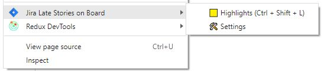

# Chorme extension to mark **Late** stories on Jira Board

## Usage

- [x] **Right Click** in any page
- [x] Click on **Jira Late Stories on Board** / **View highlights**
  - [ ] It will open your Board if not opened
  - [ ] When the board is already open View highlights will highlight cards
- [x] **CTRL + SHIFT + L** - can be used to trigger same action as **View highlights**

## Results




## Setup

- [x] **Download** this repo as zip & Unzip it
      (or git `clone https://github.com/crinel/chrome-jira-board.git`)
- Open [chrome://extensions/](chrome://extensions/)
- **Load unpacked** Extension
- When new sprint is started use "Settings".
  - Date format is YYYY-MM-DD
  - URL must be in https://jira.com/secure/RapidBoard.jspa?rapidView=1234 format (don't include other quickFilters parameters)

## Dev Only

Run this script to cleanup data for "demo" screens

```js
document.querySelector("#ghx-board-name").innerHTML = "Demo Board";
document.querySelector(".subnavigator-title").innerHTML = "Sprint 1";
document.querySelectorAll(".ghx-controls-filters dd").forEach((e, i) => {
  i > 3 ) {
    e.innerHTML = "";
  }
});
document.querySelectorAll(".js-key-link").forEach((a, i) => (a.innerHTML = `DEMO-0${i}`));
document.querySelectorAll(".ghx-summary .ghx-inner").forEach((a, i) => (a.innerHTML = `Description to story ${i}`));
document.querySelectorAll(".ghx-avatar img").forEach(img => {
  img.src = "https://www.gravatar.com/avatar/1?d=mm&s=48";
});
```
